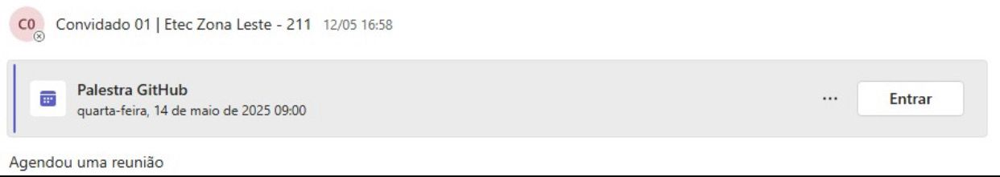
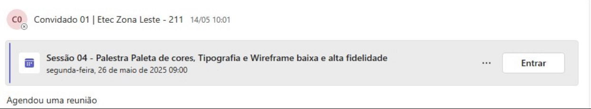
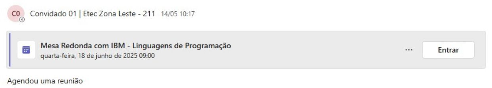
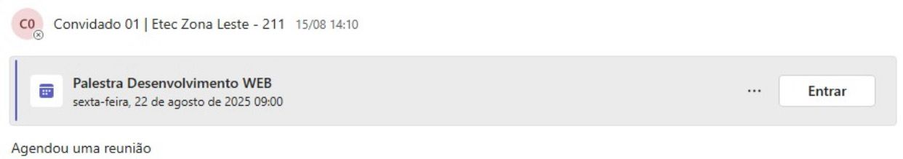
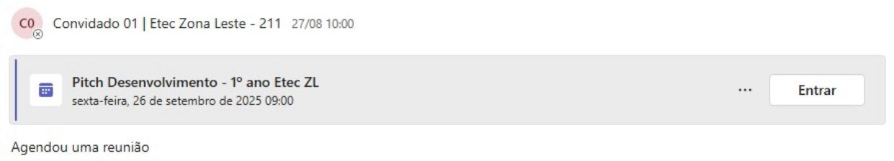

 <h1>portfolio2025DS-AMS</h1>

portfólio de 2025 do 1° ano de Densevolvimento de Sistemas (AMS), com o objetivo de documentar as atividade solicitadas da impresa patrosinadora do curso IBM registrando os feitos ao decorrer do ano letivo

<h2>credenciais dos cursos do ibm Skillsbuild</h2>
<h3>fundamentos de desenvolvimento web</h3>

<h3>habilidades profissionais</h3>

<h1>imagens de compromissos que tive com a empresa IBM</h1>

h3>palestra dia 14 de maio de 2025</h3>
    

<h3>palestra 26 de maio de 2025</h3>

<h3>palestra 18 de junho de 2025</h3>

<h3>palestra 22 de agosto de 2025</h3>

<h3>palestra 26 de setembro de 2025</h3>

